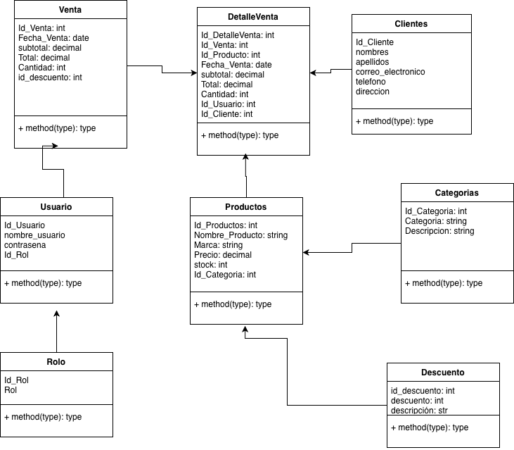

# sistema de ventas de productos electronicos

este sistema consiste en 

formato de el archivo .env
```bash
cp .env.example .env
```

## diagrama de clases


## division del trabajo

jasmine: marcas, 
jerferson: descuento,
litzy: categorias
manases: 
